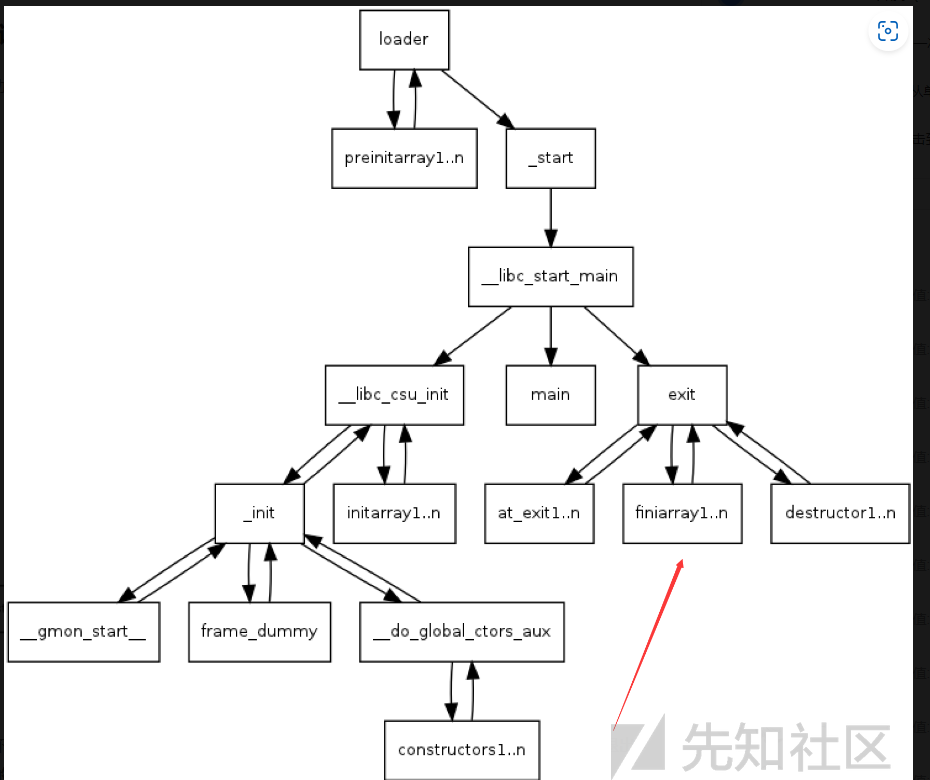

# 格式化字符串的个人理解

## .fini_array函数的用法

这里在近期的学习中我们学到了这个利用手法其主要的用法这里要了解这攻击手法我们就要理解一些前置知识点

这里我们要明白的知识点都在这里了因此从这里我们可以明白一个点就是main函数并不是我们整个程序的起点，并且整个程序的起点是start这个函数体他会调用libc_start_main这个程序启动和退出main函数的返回地址同样是也这个函数

这里可以看到**libc_start_main的三个比较重要的参数
rdi --> main
rcx -->** libc_csu_init
r8 --> __libc_csu_fini

而这个时候就会找到fini_array这个函数体而这个函数体中存储了一个特殊的elf符号数组，用于存储在程序或者共享对象的终止清理阶段将要执行的一个终止程序

在ELF二进制文件中，除了存储初始化函数数组（.init_array）之外，还可以包含一个终止函数数组（.fini_array）。这些函数会在程序或共享对象退出或终止时以相反的顺序执行，用于进行资源清理、关闭文件描述符、释放内存等操作。
_fini_array符号是由链接器在将目标文件或库连接到可执行文件时生成的。它指向一个由终止函数地址组成的数组。运行时的链接器/加载器会在程序或共享对象终止时依次调用这些函数，以完成清理工作。
类似于_init_array，_fini_array是ELF文件中的一部分，属于特殊的节（section）之一。这些特殊节在程序执行过程中具有特定的目的和执行顺序。其他常见的特殊节包括.text（包含程序指令）和.data（包含已初始化的全局和静态数据）。

所以我们可以劫持fini_array数组来劫持程序执行流

## 格式化字符串漏洞

### 原理

这里我们主要讨论的函数时printf函数但是会存在这个漏洞的函数体时整个printf函数组，而我们讨论的这个漏洞就是这个函数族的一个设计缺陷，也就是程序在我们平时使用的一个写法中时一个非常危险的写法因此我们，所以我们在学习这个漏洞时可以通过这个printf这个危险漏洞点进行一个程序的任意地址读写

因此我们这使用一个攻防世界的一个题目就是greeting—150这个题目

这里这个题目的主要的攻击手法就是使用修改got表的方式来进行一个写入

