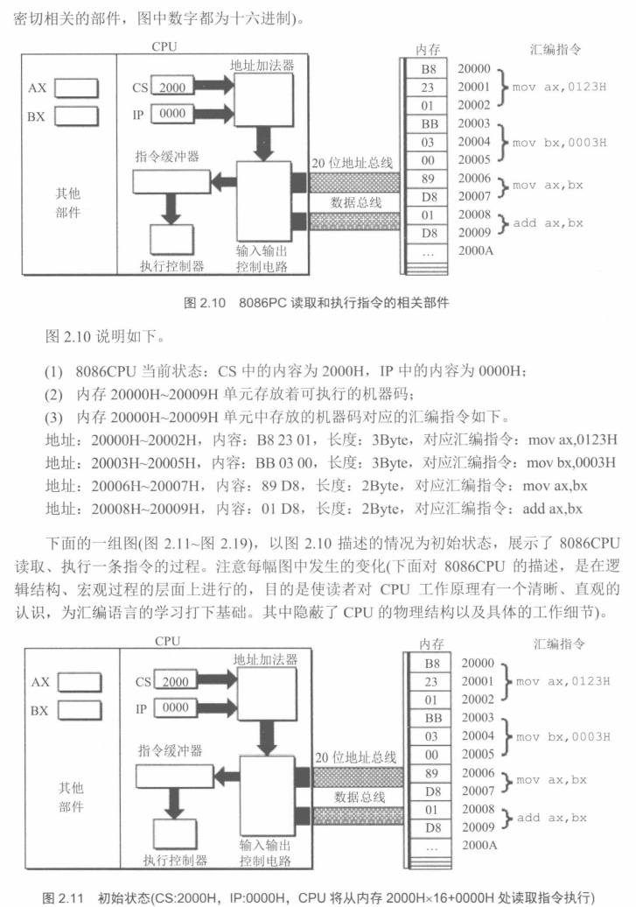
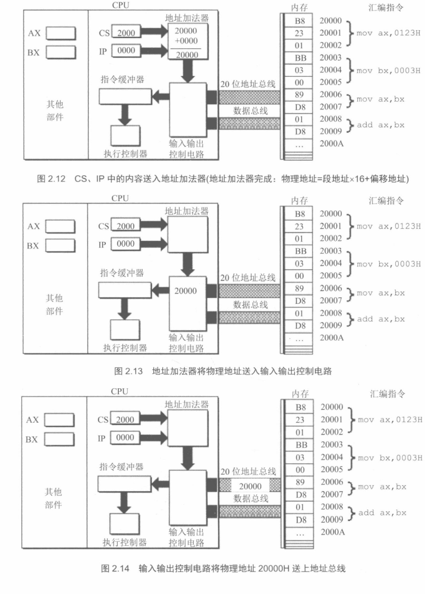
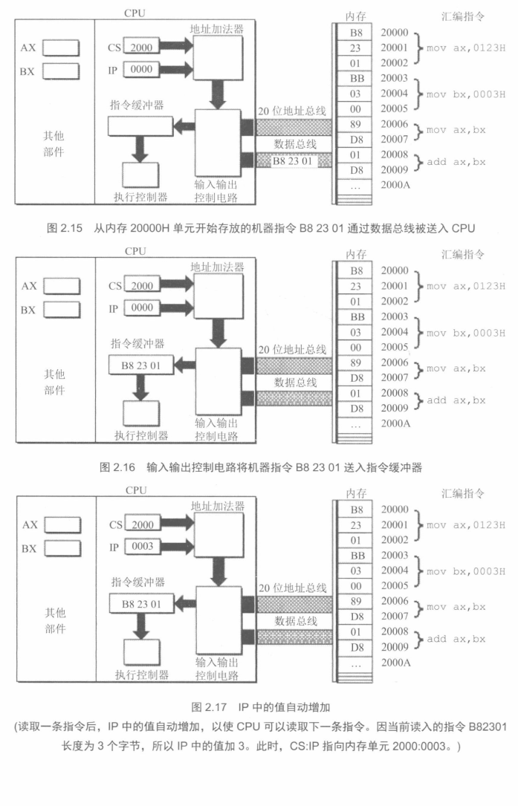
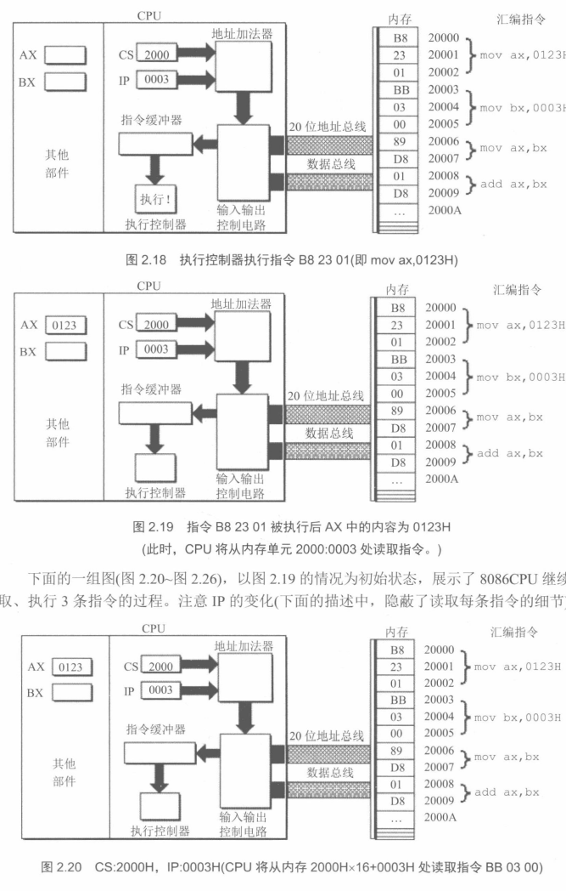
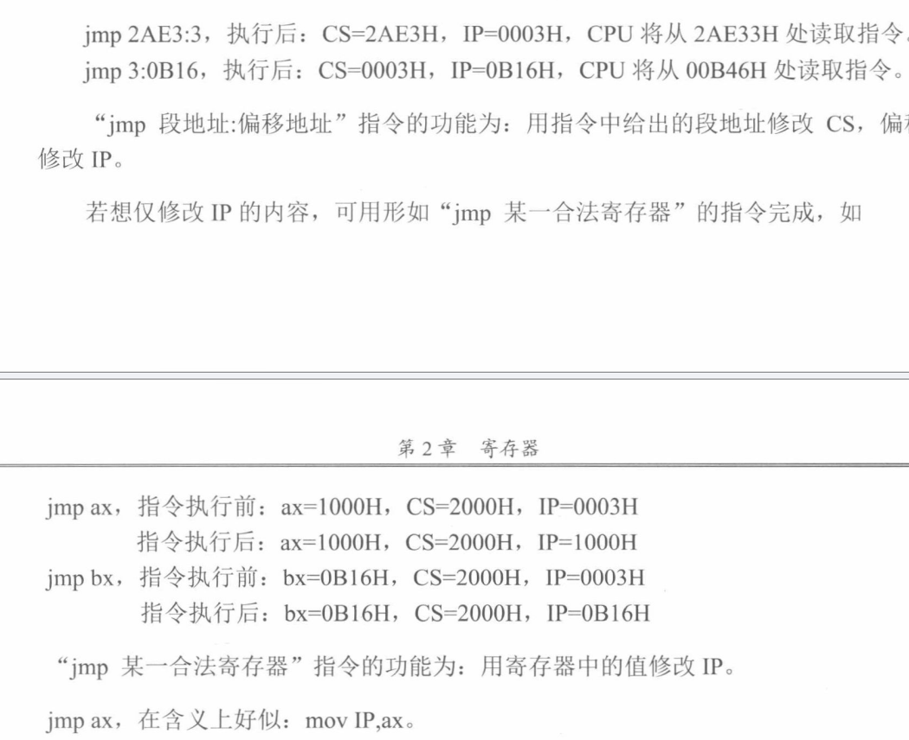

# 汇编语言

## 1概述和基础知识

### 概述

汇编语言是直接运用在硬件之上工作的语言

### 1.1机器语言

在早期的计算机中任何值的输入都是用二进制的方法进行输入，所以二进制的数没我们俗称位机器语言，因此我们可以知道一点cpu他只认识机器语言。

但是这里也会出先一个弊端就是在机器语言中一个数字打错就要从头而第二个弊端就是不好进行记同时要给字符串中的数据也太大了所以我们在后期引发出了汇编语言

### 1.2汇编语言的产生

在上面可以知道他有两个弊端而汇编语言就是为了来弥补这里几个弊端而来的同时也加入了一个新的机制也就是编译器

### 1.3汇编语言的组成

1.汇编指令：他是对应这每一个机器码

2.伪指令：没有对应的机器码是编译器执行的而计算机不会执行

3.其他字符：这些字符有编译器来识别

> [!NOTE]
>
> 汇编指令同样是汇编语言的核心

### 1.4存储器

他是cpu中的一个交换信息的核心部件

### 1.5指令和数据

指令和数据是

---

而这里也没有什么可以学到总结就是2^n的地址总线，明白在cpu中任何不见和存储器中都是以总线相连接

## 2寄存器

### 2.1通用寄存器

8086cpu一共有16个也就是说他是一个16位的寄存器，而这些寄存器可以存放2个字节。其中AX，BX，CX，DX这里几个寄存器通常用来存放一些一般性的数据，就被成为通用寄存器

但是由于8086的上一代是八位的cpu为了兼容问题就可以把这里四个分为8个寄存器

- ax：ah，al
- bx：bh，bl
- cx：ch，cl
- dx：dh，dl

用这样的方式来兼容8位的cpu

### 2.2字在寄存器中的存储

这里主要是知道一个转换方法一个字分为两个字节一个字节是由8bit组成

### 2.3几条简单的汇编指令

|   指令    |     完成的操作     | 高级语言的描述 |
| :-------: | :----------------: | :------------: |
| mov ax,18 | 将18送入ax寄存器中 |     ax=18      |
| mov ah,78 | 将78送入ah寄存器中 |     ah=78      |
| add ax,8  | 把ax中的数和8相加  |    ax=ax+8     |
| mov ax,bx | 把bx中的数送入ax中 |     ax=bx      |
| add ax,bx |    把ax和bx相加    |    ax=ax+bx    |

### 2.4-6没有重要的

主要是让我们明白物理地址和一些物理地址

同时2.6的是让我明白了在计算器中是如何进行加法运算的，他们是用记录地址的方法把地址中存储的数据进行加法运算而其他的运算和这个方法是一样的

### 2.7段地址x16+偏移=物理地址

在一个程序运行时他会随机生成一个前4位的地址而后面的地址就会成为这个文件的相对地址而这也就是我们所说的偏移

### 2.8段

在正常的内存中时没有段这个概念但是由于但是如果我们进行存放数据时是一个连续的存放因此这个范围就会被称为一个段我们还有一个其他的名称就是内存段

同时由于基地址是段地址计算来的也就是段地址x16也就是说段地址的一个启示位置就是16的一个倍数关系而他的寻址就是64kb，这里也可以明白长度最大为64kb

### 2.9段寄存器

段寄存器有cs，ds，ss，es四个

### 2.10cs和ip寄存器

这里的寄存器主要是对指令数据的一个调用其中cs是一个段寄存器，ip就是指令指针寄存器

在pc机中cs:ip指向的内容就是一个指令需要执行的命令

这个就是cs:ip进行调用的规则

### 2.11修改cs，ip的指令

如果想要修改cs，ip中的内容，可以用jmp 段地址:偏移地址的指令来完成

同时还有一些不同的方法

### 2.12代码段

### 3.6栈

栈的空间主要的一点就是先进后出的一个其中push（入栈）和pop（出栈）并且是从
